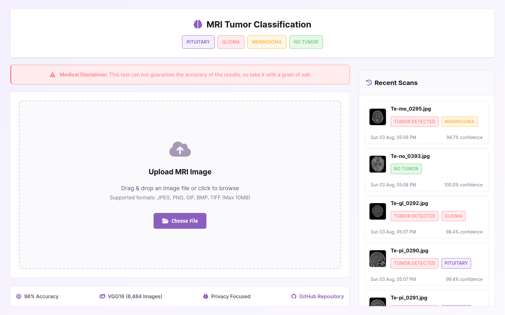
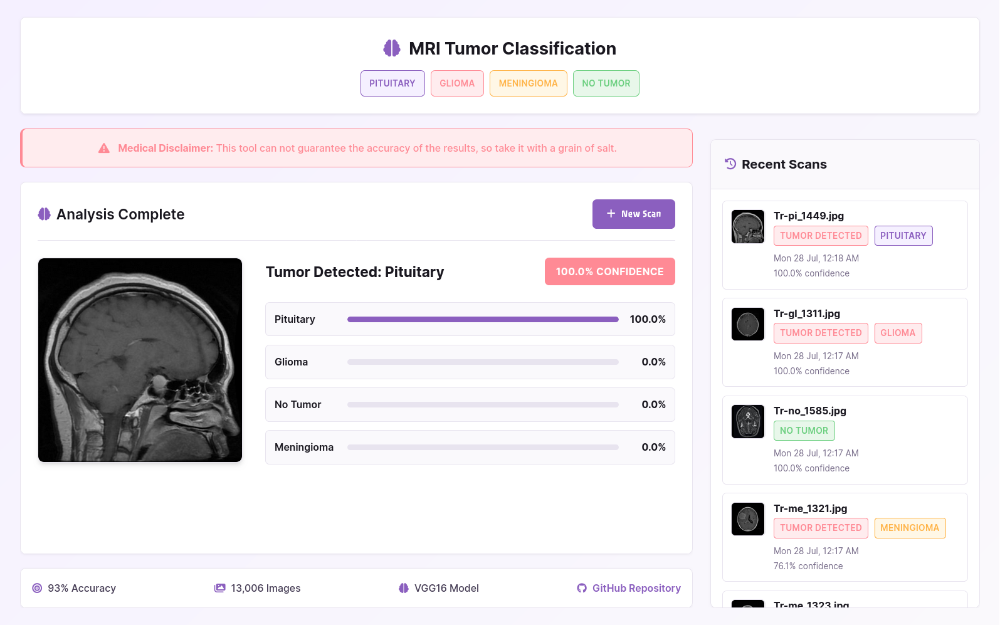
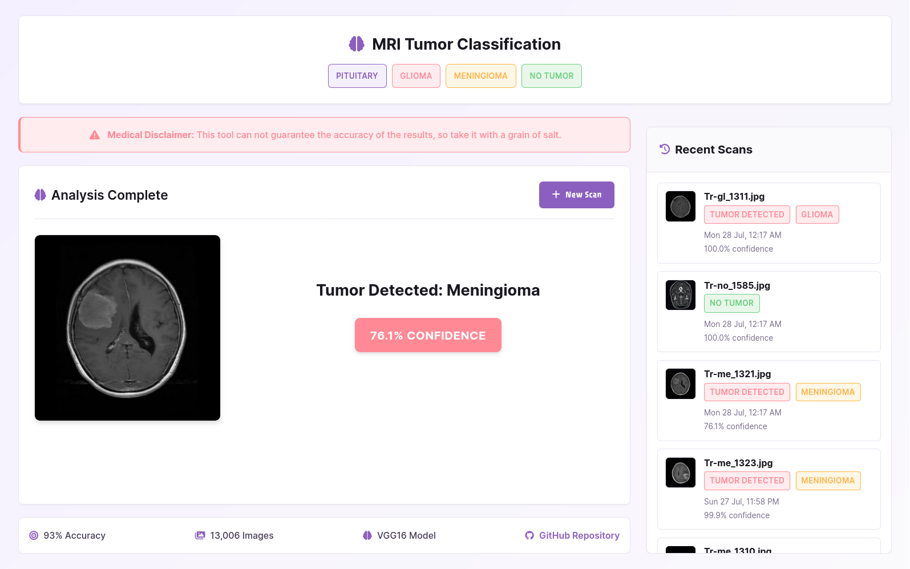
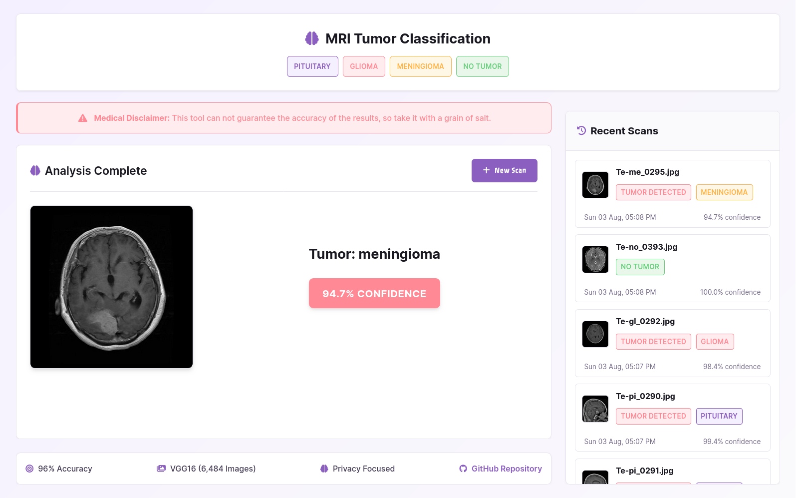
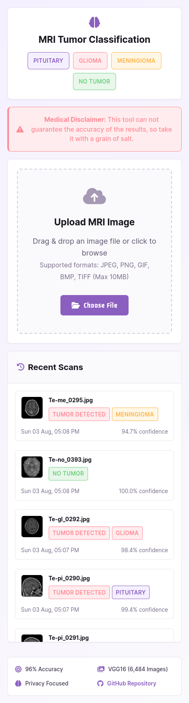
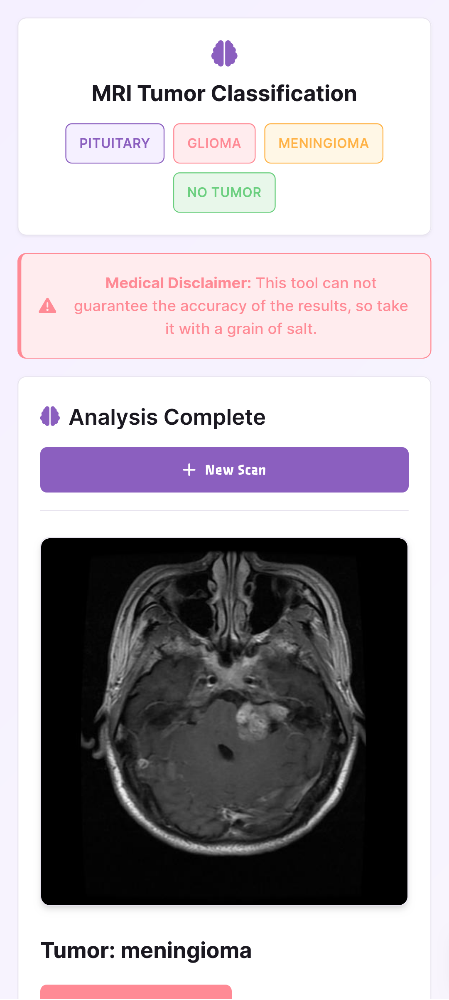
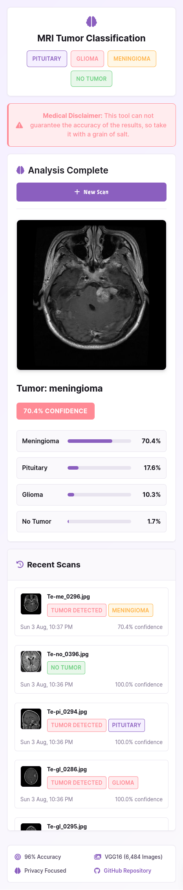
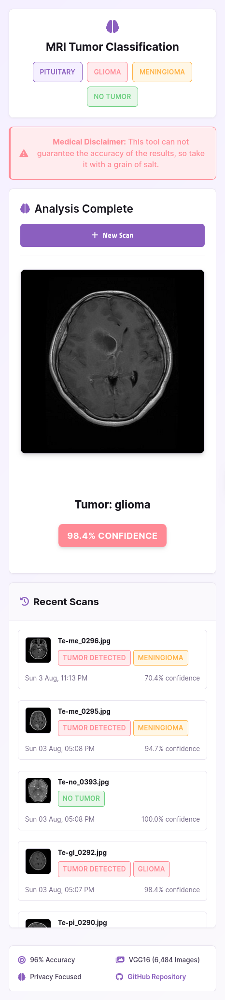

# 🧠 Brain Tumor Detection Web App

A Flask-based web application that uses a trained deep learning model to detect brain tumors from MRI images.

<br>

## 📁 Folder Structure

```
project-root/
│
├── static/
├── templates/
├── model.h5                # Trained Keras model
├── label_map.json
├── app.py                  # Main Flask app
├── requirements.txt
└── README.md
```

<br>

## 🚀 Usage Guide

### 1️⃣ Clone the Repository

```bash
git clone https://github.com/ShrekBytes/tui_mor.git
cd tui_mor
```

<br>

### 2️⃣ Create and Activate Virtual Environment

```bash
python -m venv .venv
source .venv/bin/activate  # On Windows: .venv\Scripts\activate
```

<br>

### 3️⃣ Install Dependencies

```bash
pip install -r requirements.txt
```

<br>

### 4️⃣ Run the Flask App

```bash
python app.py
```

Visit the app in your browser:

```
http://127.0.0.1:5555
```

<br>

## 🧪 Features

- Upload an MRI image
- Predict tumor type: `glioma`, `meningioma`, `pituitary`, or `no tumor`
- Display confidence score
- View image with result overlay
- Privacy focused (does not store any data, scan histories are stored on browser session)
- JSON-based label mapping for easy customization

<br>

## 📸 Screenshots





<p align="center">
  
  
  
  
</p>


<br>

## 📄 License

This project is licensed under the MIT License.
Feel free to fork, modify, and use it for your own purposes.

---
