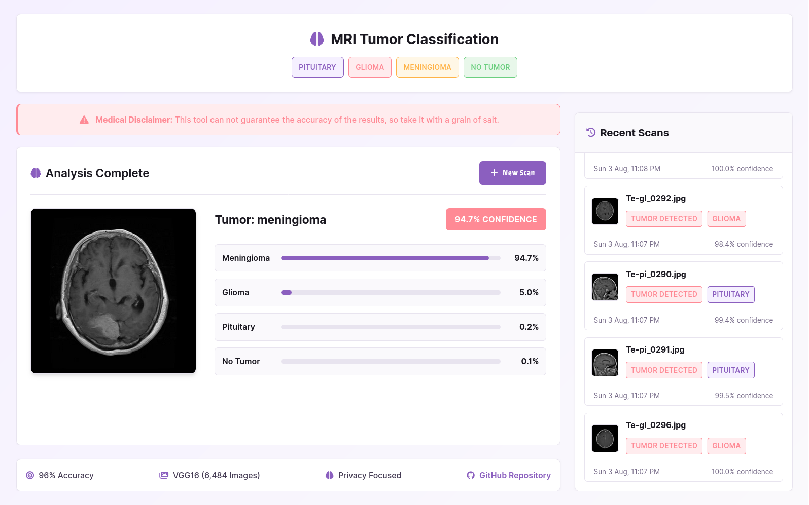

# 🧠 Brain Tumor Detection Web App

A Flask-based web application that uses a trained deep learning model to detect brain tumors from MRI images.


## 📁 Folder Structure

```

project-root/  
│  
├── static/  
├── templates/
├── model.h5 # Trained Keras model (downloaded separately)  
├── app.py # Main Flask app  
├── requirements.txt
└──

````


## 🔗 Download the Model

📥 [Download the trained model file (`model.h5`)](https://drive.google.com/file/d/1_KAIOS3zkoMWtj2P1xmB65qUsI2hsqxR/view?usp=sharing)  
Place it in the root directory of the project (same level as `app.py`).


## 📦 Install Dependencies

Create a virtual environment (recommended):

```bash
python -m venv .venv
source .venv/bin/activate  # On Windows: .venv\Scripts\activate
````

Then install dependencies:

```bash
pip install -r requirements.txt
```


## 🚀 Run the App

```bash
python app.py
```

Then open your browser and visit:

```
http://127.0.0.1:5555
```


## 🧪 Features

- Upload an MRI image.
    
- Predict tumor type: `glioma`, `meningioma`, `pituitary`, or `no tumor`.
    
- Displays confidence score.
    
- Shows uploaded image with result overlay.
 


## 📸 Screenshots





## 📄 License

This project is licensed under the MIT License.  
Feel free to fork, modify, and use it for your own purposes.
